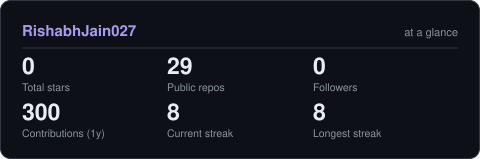
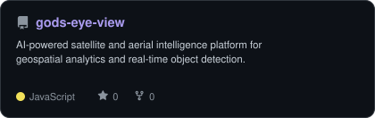
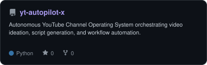
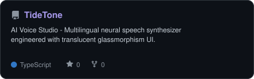
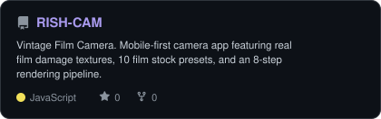

<!-- BANNER - terminal profile.sh --live (additive). Generated by scripts/banner/generate.py.
     Cache-bust with ?v=N after regenerating. -->
<picture>
  <source media="(prefers-color-scheme: dark)"  srcset="assets/banner-dark.v9.svg">
  <source media="(prefers-color-scheme: light)" srcset="assets/banner-light.v9.svg">
  
</picture>

 

<!-- NAME / TAGLINE - animated typing -->

 

<!-- SOCIALS — LinkedIn stays brand blue. Others themed neon lilac. -->
&nbsp;&nbsp;
&nbsp;&nbsp;
&nbsp;&nbsp;

 

---

## This is me :)

Hi, I'm **Rishabh**, engineer, cinematographer, and creative technologist broadcasting from Mumbai, India 🇮🇳.
I bridge the physical and digital realms — building connected hardware, crafting real-time interactive 3D graphics,
and capturing cinematic stories through the camera lens.

- 🎓 **Engineering at [SAKEC](https://www.shahandanchor.com/) (Mumbai)**: focused on embedded systems, structural sensing, and IoT automation.
- 🔌 **IoT & Hardware Developer**: architecting connected device ecosystems, sensor telemetry, and smart automation with real-time feedback (ESP32, Arduino UNO, Raspberry Pi).
- 🎥 **Cinematographer & Visual Storyteller**: shooting, editing, and color-grading travel films, commercial reels, and creative projects. Award-recognized in the reel-making space.
- 🧠 **Creative Technologist**: building **[Rishabh Engine](https://github.com/RishabhJain027)** & **[RISH//CAM](https://github.com/RishabhJain027/RISH-CAM)** — experimenting with React Three Fiber, custom GLSL shaders, 8-step vintage film rendering pipelines, and audio-reactive systems.
- 🤖 **Autonomous AI & Voice**: engineering autonomous operating systems (**[yt-autopilot-x](https://github.com/RishabhJain027/yt-autopilot-x)**), multilingual neural speech synthesis (**[TideTone](https://github.com/RishabhJain027/TideTone)**), and aerial intelligence (**[gods-eye-view](https://github.com/RishabhJain027/gods-eye-view)**).
- 🌱 **My mantra:** Built with hardware, held together with code, and shot on a 50mm.
- 💬 Talk to me about **Embedded Systems, Creative 3D / Shaders, or Film Lighting** and you'll have my full attention.

 

## my perfect stack`

---

## signals 

<table>
<tr>
<td width="50%" align="center" valign="middle">

<!-- Self-rated radar - edit assets/skills.json, the workflow redraws it -->
<picture>
  <source media="(prefers-color-scheme: dark)"  srcset="assets/radar-dark.svg">
  <source media="(prefers-color-scheme: light)" srcset="assets/radar-light.svg">
  
</picture>

</td>
<td width="50%" align="center" valign="middle">

<!-- Hand-authored contract & language stack radar - edit assets/langmix.json -->
<picture>
  <source media="(prefers-color-scheme: dark)"  srcset="assets/radar-langs-dark.svg">
  <source media="(prefers-color-scheme: light)" srcset="assets/radar-langs-light.svg">
  
</picture>

</td>
</tr>
</table>

---

## Numbers matter? ohhh yes. 

<!-- Generated by scripts/cards.py into this repo. Deliberately NOT
     github-readme-stats / streak-stats / github-profile-trophy: those are
     shared public instances that go down and take the whole section with them. -->
<picture>
  <source media="(prefers-color-scheme: dark)"  srcset="assets/card-stats-dark.svg">
  <source media="(prefers-color-scheme: light)" srcset="assets/card-stats-light.svg">
  
</picture>

 

---

## featured builds

<table>
<tr>
<td width="50%" align="center" valign="middle">
<a href="https://github.com/RishabhJain027/gods-eye-view">
  <picture>
    <source media="(prefers-color-scheme: dark)"  srcset="assets/card-gods-eye-view-dark.svg">
    <source media="(prefers-color-scheme: light)" srcset="assets/card-gods-eye-view-light.svg">
    
  </picture>
</a>
</td>
<td width="50%" align="center" valign="middle">
<a href="https://github.com/RishabhJain027/yt-autopilot-x">
  <picture>
    <source media="(prefers-color-scheme: dark)"  srcset="assets/card-yt-autopilot-x-dark.svg">
    <source media="(prefers-color-scheme: light)" srcset="assets/card-yt-autopilot-x-light.svg">
    
  </picture>
</a>
</td>
</tr>
<tr>
<td width="50%" align="center" valign="middle">
<a href="https://github.com/RishabhJain027/TideTone">
  <picture>
    <source media="(prefers-color-scheme: dark)"  srcset="assets/card-TideTone-dark.svg">
    <source media="(prefers-color-scheme: light)" srcset="assets/card-TideTone-light.svg">
    
  </picture>
</a>
</td>
<td width="50%" align="center" valign="middle">
<a href="https://github.com/RishabhJain027/RISH-CAM">
  <picture>
    <source media="(prefers-color-scheme: dark)"  srcset="assets/card-RISH-CAM-dark.svg">
    <source media="(prefers-color-scheme: light)" srcset="assets/card-RISH-CAM-light.svg">
    
  </picture>
</a>
</td>
</tr>
</table>

---

` Built with hardware, held together with code · @r1sh.jpeg `

