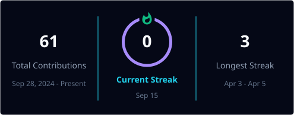
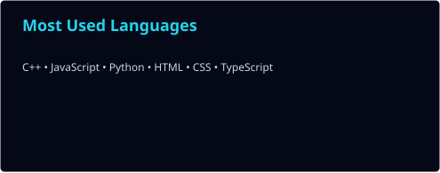

<div align="center">


<h1>Rishabh Jain</h1>


<br/>


<br/><br/>

<a href="https://github.com/RishabhJain027"></a>
<a href="https://www.linkedin.com/in/rish-abh27/"></a>
<a href="https://www.instagram.com/r1sh.jpeg/"></a>
<a href="https://www.youtube.com/@rish-abh27"></a>


</div>

---

## 👋 Hello, I'm Rishabh

<div align="center">
<table width="100%">
<tr>
<td bgcolor="#07111F">

I’m an engineering student and builder who enjoys the space where **hardware, software, AI, automation and visual creativity** overlap.

I don't really like building things just to say I built them. I like the full journey: figuring out the problem, making a rough prototype, breaking it, debugging it, polishing the experience and finally putting it somewhere people can actually use.

That has taken me through **Arduino and ESP32 systems, Bluetooth automation, web interfaces, AI workflows, games, bots, camera experiments and creative technology**.

### What usually gets me excited

⚡ A physical device that actually responds.  
🤖 An automation workflow that removes repetitive work.  
🌐 A frontend that feels as good as it functions.  
🎮 A strange little game or experiment that becomes unexpectedly fun.  
🎥 A camera or visual idea that can become a real technical product.

</td>
</tr>
</table>
</div>

---

# 🧭 `RISHABH.OS // CURRENTLY`

<div align="center">
<table width="100%">
<tr>
<td bgcolor="#050816">

```text
┌──────────────────────────────────────────────────────────────┐
│ USER             RISHABH JAIN                               │
│ MODE             BUILD / EXPERIMENT / SHIP                  │
│ CORE             IoT + AI + WEB + CREATIVE TECHNOLOGY      │
│ HARDWARE         Arduino / ESP32 / Bluetooth / Sensors     │
│ CODE             C++ / Java / Python / JavaScript          │
│ FRONTEND         HTML / CSS / JS / React / Three.js        │
│ CREATIVE         Camera / Cinematography / Visual Systems  │
│ STATUS           ████████████████████████████████  ONLINE   │
└──────────────────────────────────────────────────────────────┘
```

</td>
</tr>
</table>
</div>

---

# 🎨 `THEME // HOW I LIKE TO BUILD`

<div align="center">

### 🌌 Dark mode
`Deep Space` `#050816` → `Cyan` `#22D3EE` → `Violet` `#A78BFA` → `Emerald` `#10B981`

### ☀️ Light mode
`Clean White` `#F8FAFC` → `Teal` `#0891B2` → `Violet` `#7C3AED` → `Slate` `#334155`

</div>

The page is deliberately structured as **one full section after another** instead of compressed side-by-side blocks. That keeps the profile readable on GitHub while still giving it the feel of a personal landing page.

---

# 🎯 `FOCUS_LEVELS // BUILD RADAR`

<div align="center">
<table width="100%">
<tr><td bgcolor="#07111F">

### 🔧 01 · IoT & Embedded Systems
**100% · Primary**

```text
████████████████████████████████████████
```

Arduino • ESP32 • Bluetooth • Sensors • Automation • Device control

</td></tr>

<tr><td bgcolor="#0B0A1A">

### 🤖 02 · AI & Automation
**95% · Primary**

```text
██████████████████████████████████████░░
```

AI workflows • Content automation • Developer tooling • AI-video experimentation

</td></tr>

<tr><td bgcolor="#07111F">

### 🌐 03 · Frontend & Web
**90% · Primary**

```text
██████████████████████████████████████░░
```

HTML • CSS • JavaScript • React • Three.js • Interactive interfaces • Deployment

</td></tr>

<tr><td bgcolor="#0B0A1A">

### 🎨 04 · Creative Technology
**88% · Strong**

```text
██████████████████████████████████████░░░
```

Interactive experiments • Visual systems • Creative software • Technology + design

</td></tr>

<tr><td bgcolor="#07111F">

### 🎥 05 · Cinematography
**88% · Creative**

```text
██████████████████████████████████████░░░
```

Camera work • Film aesthetics • Visual storytelling • Creative production

</td></tr>

<tr><td bgcolor="#0B0A1A">

### 🎮 06 · Game Development
**78% · Exploring**

```text
██████████████████████████████████░░░░░░
```

Games • Bots • Offline experiments • Interactive mechanics

</td></tr>

</table>
</div>

---

# 🧩 `SKILL_LAYERS // FROM CIRCUIT TO SCREEN`

### Layer 01 — Hardware ⚙️

```text
Arduino → ESP32 → Sensors → Bluetooth → Automation → Real-time behaviour
```

I enjoy projects where software has to interact with something physical and the result can be observed immediately.

### Layer 02 — Intelligence 🤖

```text
Problem → Data / Model → Workflow → Automation → Repeatable Result
```

The goal is not "AI for the sake of AI"; it's using AI where it genuinely removes work, unlocks an idea or makes a workflow more capable.

### Layer 03 — Frontend 🌐

```text
Structure → Visual system → Interaction → Motion → Product experience
```

I care about the difference between something that technically works and something that actually feels good to use.

### Layer 04 — Creative Technology 🎥

```text
Camera + Code + Design + Storytelling = Creative System
```

This is where engineering and cinematography overlap for me.

---

# 🚀 `CREATIONS // WHAT I'VE BEEN BUILDING`

## 🤖 AI + AUTOMATION

### `yt-autopilot-x`
A project around **YouTube/content automation workflows** and the systems needed to make content production more repeatable.

🔗 https://github.com/RishabhJain027/yt-autopilot-x

### `ComfyUI-MiniMaxH3-Easy`
A **ComfyUI / AI-video-generation experiment**, focused on making an advanced workflow easier to work with.

🔗 https://github.com/RishabhJain027/ComfyUI-MiniMaxH3-Easy

---

## 🔧 IoT + HARDWARE

### `esp32-smart-campus`
An ESP32-oriented **smart-campus / IoT system** project.

🔗 https://github.com/RishabhJain027/esp32-smart-campus

### `smart-campus-deploy-2026`
A deployment-oriented continuation around the smart-campus direction.

🔗 https://github.com/RishabhJain027/smart-campus-deploy-2026

### `Smart-Bluetooth-Automation-Alert-System-using-Arduino-UNO`
One of my clearest hardware proof-of-work projects: **Arduino UNO + Bluetooth + automation + timed actions + alerts + two-way communication**.

🔗 https://github.com/RishabhJain027/Smart-Bluetooth-Automation-Alert-System-using-Arduino-UNO

---

## 🌐 WEB + PRODUCT BUILDS

### `nova-brokers`
A web-platform project exploring a larger application/product experience.

🔗 https://github.com/RishabhJain027/nova-brokers

### `rish-weather-detector`
A weather application experiment built around a clean web interface.

🔗 https://github.com/RishabhJain027/rish-weather-detector

### `news-api`
An API-integration project focused on bringing news data into an application.

🔗 https://github.com/RishabhJain027/news-api

### `DYNAMIC-CLOCK-CALENDER`
A dynamic clock + calendar interface project.

🔗 https://github.com/RishabhJain027/DYNAMIC-CLOCK-CALENDER

### `astro-platform-starter`
A platform-starter / web experimentation repository.

🔗 https://github.com/RishabhJain027/astro-platform-starter

---

## 🎮 GAMES + BOTS

### `PokemonDawnAndDusk`
An offline Pokémon-inspired game project.

🔗 https://github.com/RishabhJain027/PokemonDawnAndDusk

### `dungeon-chaser`
A game-focused experimental project.

🔗 https://github.com/RishabhJain027/dungeon-chaser

### `starcraft-bot`
A game-bot / automation experiment.

🔗 https://github.com/RishabhJain027/starcraft-bot

### `Switz-Guesser`
An interactive guessing-game project.

🔗 https://github.com/RishabhJain027/Switz-Guesser

---

## 🎥 CREATIVE + INTERACTION

### `RISH-CAM`
A camera / creative-tooling experiment where software and visual work meet.

🔗 https://github.com/RishabhJain027/RISH-CAM

### `MellowMist`
A creative application experiment.

🔗 https://github.com/RishabhJain027/MellowMist

### `TideTone`
A creative / interactive application experiment.

🔗 https://github.com/RishabhJain027/TideTone

### `hand-gestures`
A gesture-based interaction experiment.

🔗 https://github.com/RishabhJain027/hand-gestures

### `meowme`
A smart cat-discovery platform experiment.

🔗 https://github.com/RishabhJain027/meowme

### `routecraft-ai`
An AI-assisted route / planning experiment.

🔗 https://github.com/RishabhJain027/routecraft-ai

---

## 📚 FOUNDATIONS

### `java`
Core Java learning and fundamentals.

🔗 https://github.com/RishabhJain027/java

---

# 🗺️ `MY BUILD MAP`

<div align="center">
<table width="100%">
<tr><td bgcolor="#050816">

```text
                    RISHABH JAIN
                          │
        ┌─────────────────┼─────────────────┐
        │                 │                 │
     HARDWARE             AI               WEB
        │                 │                 │
 Arduino / ESP32    Automation / Video    JS / React
 Bluetooth / IoT    Workflows / Tools     3D / UI
        │                 │                 │
        └─────────────────┼─────────────────┘
                          │
                    CREATIVE TECH
                          │
                Camera / Film / Visuals
                          │
                          ▼
                   REAL PRODUCTS
```

</td></tr>
</table>
</div>

---

# 🧠 `HOW_I_WORK`

### `01 // DISCOVER`

Find the actual problem before jumping into technology.

### `02 // DESIGN`

Sketch the architecture, interaction and constraints.

### `03 // PROTOTYPE`

Build a rough version quickly.

### `04 // BREAK`

Try to expose every weak point.

### `05 // DEBUG`

Understand why it failed instead of just patching the symptom.

### `06 // POLISH`

Improve the UI, reliability, performance and overall experience.

### `07 // SHIP`

Deploy it, share it and let the real world interact with it.

### `08 // ITERATE`

Use what I learn from the build to create the next version.

---

# 📡 `GITHUB TELEMETRY // REAL DATA`

The cards in this section are **repository-local SVGs**. GitHub Actions generates them and commits the results into `profile/`, so the README isn't relying on the shared public `github-readme-stats.vercel.app` endpoint for its core statistics. The current GitHub Readme Stats documentation recommends GitHub Actions as a way to generate static SVGs locally and avoid per-request API calls. citeturn441501search1turn441501search2

## 🔥 Contribution Streak

<div align="center">

<picture>
  <source media="(prefers-color-scheme: dark)" srcset="./profile/streak-dark.svg">
  <source media="(prefers-color-scheme: light)" srcset="./profile/streak-light.svg">
  
</picture>

</div>

## 💻 GitHub Statistics

<div align="center">

<picture>
  <source media="(prefers-color-scheme: dark)" srcset="./profile/stats-dark.svg">
  <source media="(prefers-color-scheme: light)" srcset="./profile/stats-light.svg">
  
</picture>

</div>

## 🧑‍💻 Most Used Languages

<div align="center">

<picture>
  <source media="(prefers-color-scheme: dark)" srcset="./profile/top-langs-dark.svg">
  <source media="(prefers-color-scheme: light)" srcset="./profile/top-langs-light.svg">
  
</picture>

</div>

> **Note:** top-language percentage is a measure of the code volume represented in the repositories being analyzed; it should not be read as a ranking of engineering skill.

---

# 🐍 `CONTRIBUTION_SNAKE`

<div align="center">

<picture>
  <source media="(prefers-color-scheme: dark)" srcset="https://raw.githubusercontent.com/RishabhJain027/RishabhJain027/output/github-snake-dark.svg">
  <source media="(prefers-color-scheme: light)" srcset="https://raw.githubusercontent.com/RishabhJain027/RishabhJain027/output/github-snake.svg">
  
</picture>

</div>

---

# 🏆 `ACHIEVEMENTS`

<div align="center">


</div>

---

# 📈 `ENGINEERING_TRAJECTORY`

### Before

```text
Programming fundamentals
        ↓
Java / C++
        ↓
Arduino + hardware experiments
```

### Now

```text
IoT + ESP32
     +
AI + automation
     +
Frontend + interactive web
     +
AI video experiments
     +
Games / bots
     +
Creative technology
```

### Next

```text
Bigger end-to-end products
          ↓
Smarter automation systems
          ↓
Deeper hardware + software integration
          ↓
More ambitious interactive experiences
          ↓
Products that are useful AND memorable
```

---

# 💭 `BUILD_PHILOSOPHY`

<div align="center">


</div>

---

# 🔗 `LET'S_CONNECT`

<div align="center">

<a href="https://www.linkedin.com/in/rish-abh27/">

</a>

<br/><br/>

<a href="https://www.instagram.com/r1sh.jpeg/">

</a>

<br/><br/>

<a href="https://www.youtube.com/@rish-abh27">

</a>

</div>

---

<div align="center">


### `BUILDING • EXPERIMENTING • SHIPPING`

<sub>Rishabh Jain · RishabhJain027</sub>

</div>
